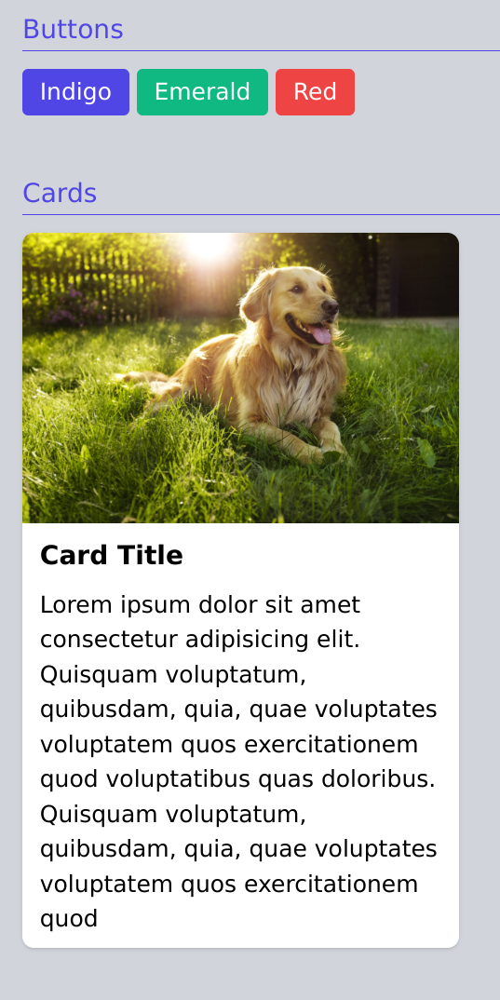
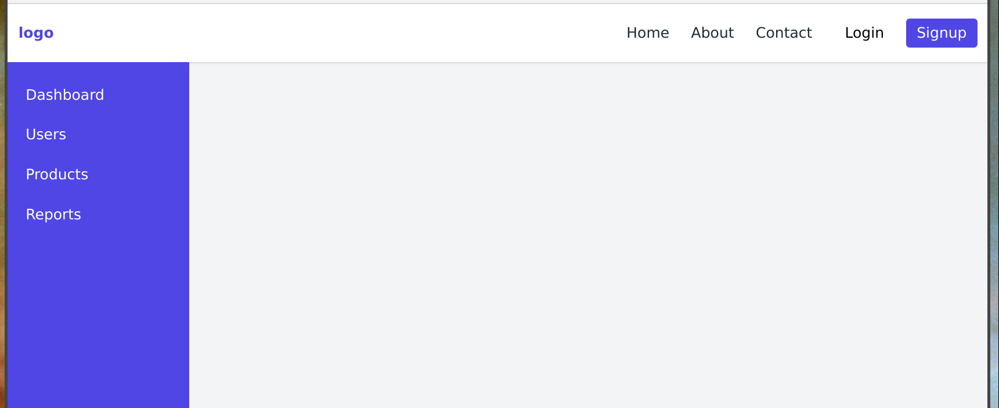

# tailwind css crash course

## to run:

1. start the tailwind transpiler (from the project dir)

   ```sh
   npx tailwindcss -i ./src/input.css -o ./dist/output.css --watch
   ```

2. open the [index](./src/index.html) and [sidebar](./src/sidebar.html) pages in your browser

## project setup

```sh
# init node project
npm init -y

# install tailwind as dev dependency
npm i -D tailwindcss

# generate tailwind.config.js file
npx tailwindcss init
# then, in that file, added the following file pattern for watching, in the "content" array: ["./src/**/*.{html,js}"],

# tell tailwind to watch for changes
npx tailwindcss build ./src/input.css -o ./dist/output.css --watch
# note, in the vid, he used the following, which produced an error.  guessing it's a legacy command:
# npx tailwindcss -i ./src/input.css -o ./dist/output.css --watch

# installed the [Tailwind CSS IntelliSense](https://marketplace.visualstudio.com/items?itemName=bradlc.vscode-tailwindcss) extension in VS Code
```

## learning notes

- tailwind css intellisense plugin for vscode is essential
- `/25` indicates an opacity of 25
- `sm:flex` creates a media query that will only show on smaller screens
- `w-[300px]` bracket notation allows you to specify exact pixels

## page snapshots:

### index



### sidebar


